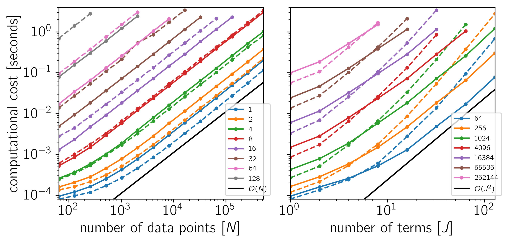
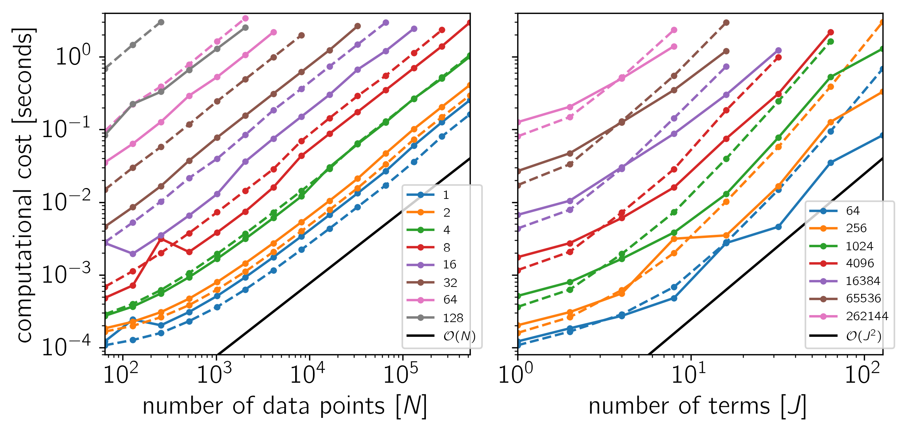
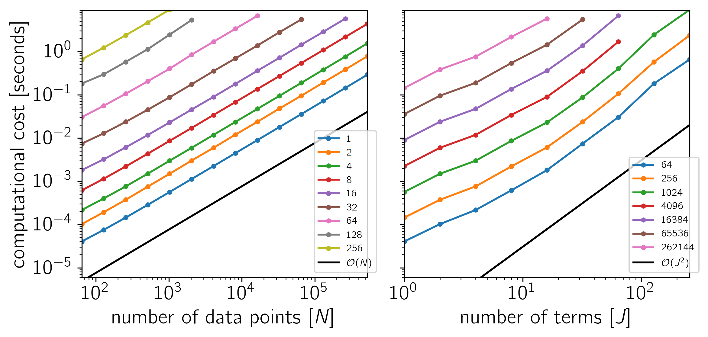

.. _benchmark:

Benchmark
=========

To test the scaling of the celerite algorithm, the following figures show the
computational cost of

.. code-block:: python

    gp.compute(x, yerr)
    gp.log_likelihood(y)

as a function of the number of data points :math:`N` and the number of terms
:math:`J`. The theoretical scaling of this algorithm should be
:math:`\mathcal{O}(N\,J^2)`.

The code for this example is `available on GitHub
<https://github.com/dfm/celerite/blob/master/examples/benchmark/run.py>`_ and
below we show the results for a few different systems.
In each plot, the computational time is plotted as a function of :math:`N` or
:math:`J` and the colors correspond to the other dimension as indicated by the
legend.

**Example 1**: On macOS with Eigen 3.3.3, pybind11 2.0.1, and NumPy 1.12.0.

**Example 2**: On Linux with Eigen 3.3.3, pybind11 2.0.1, and NumPy 1.12.0.

**Example 3**: For comparison, a CARMA solver using a Kalman filter.
On Linux with Eigen 3.3.3, pybind11 2.0.1, and NumPy 1.12.0.

