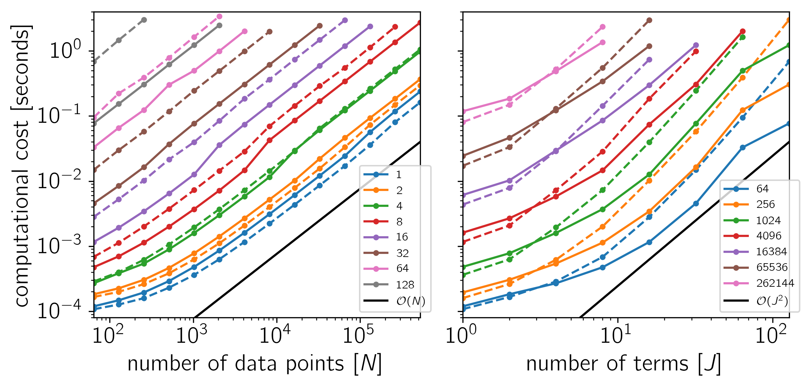

.. _benchmark:

Benchmark
=========

To test the scaling of the celerite algorithm, the following figures show the
computational cost of

.. code-block:: python

    gp.compute(x, yerr)
    gp.log_likelihood(y)

as a function of the number of data points :math:`N` and the number of terms
:math:`J`. The theoretical scaling of this algorithm should be
:math:`\mathcal{O}(N\,J^2)` and that's what we find if celerite is linked to a
LAPACK implementation. The algorithm that is used in the absence of a LAPACK
library scales poorly to large :math:`J` but it is more efficient for small
:math:`J \lesssim 8`.

The code for this example is `available on GitHub
<https://github.com/dfm/celerite/blob/master/examples/benchmark/run.py>`_ and
below we show the results for a few different systems.
In each plot, the computational time is plotted as a function of :math:`N` or
:math:`J` and the colors correspond to the other dimension as indicated by the
legend.
The solid lines correspond to the cost when LAPACK is used and the dashed
lines show the cost of the simple base algorithm.
Both algorithms scale as :math:`\mathcal{O}(N)` for all :math:`J` but the
simple algorithm is only preferred for small :math:`J`.

**Example 1**: On macOS with Eigen 3.3.1, pybind11 2.0.1, NumPy 1.12.0, and
MKL 2017.0.1.

.. image:: benchmark_darwin_mkl.png

**Example 2**: On macOS with Eigen 3.3.1, pybind11 2.0.1, NumPy 1.12.0, and
Apple's Accelerate framework.

.. image:: benchmark_darwin.png

**Example 3**: On Linux with Eigen 3.3.1, pybind11 2.0.1, NumPy 1.12.0, and
MKL 2017.0.1.

**Example 4**: On Linux with Eigen 3.3.1, pybind11 2.0.1, NumPy 1.12.0, and
OpenBLAS 0.2.19.

.. image:: benchmark_linux.png
