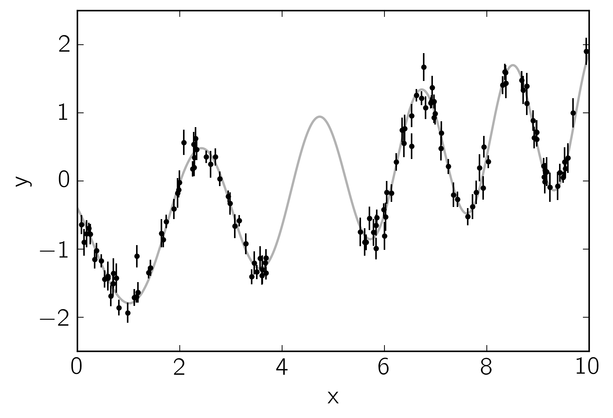
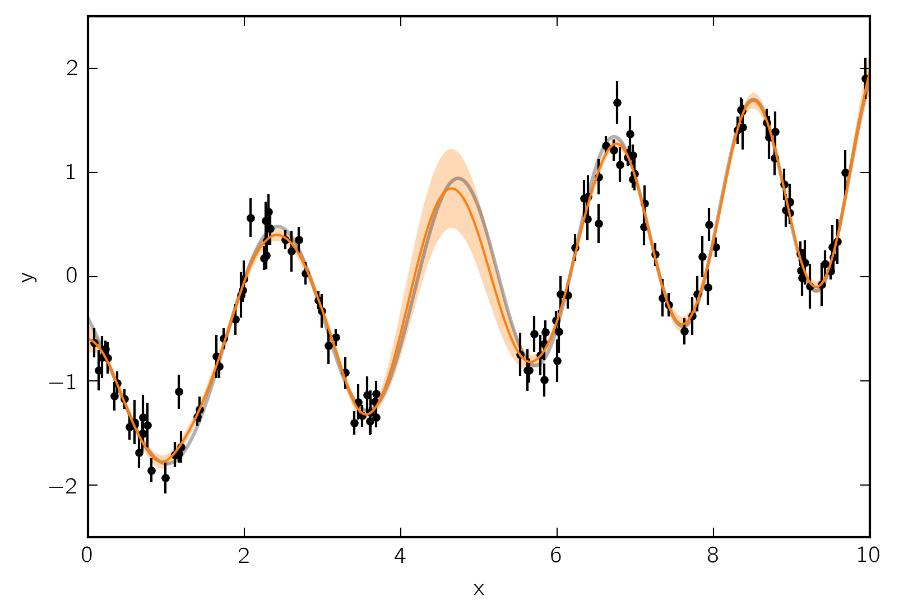

.. module:: celerite

.. note:: This tutorial was generated from an IPython notebook that can be
          downloaded `here <../../_static/notebooks/first.ipynb>`_.

.. _first:

Python: First Steps
===================

For this tutorial, we're going to fit a Gaussian Process (GP) model to a
simulated dataset with quasiperiodic oscillations. We're also going to
leave a gap in the simulated data and we'll use the GP model to predict
what we would have observed for those "missing" datapoints.

To start, here's some code to simulate the dataset:

.. code:: python

    import numpy as np
    import matplotlib.pyplot as plt
    np.random.seed(42)
    
    t = np.sort(np.append(
        np.random.uniform(0, 3.8, 57),
        np.random.uniform(5.5, 10, 68),
    ))  # The input coordinates must be sorted
    yerr = np.random.uniform(0.08, 0.22, len(t))
    y = 0.2 * (t-5) + np.sin(3*t + 0.1*(t-5)**2) + yerr * np.random.randn(len(t))
    
    true_t = np.linspace(0, 10, 5000)
    true_y = 0.2 * (true_t-5) + np.sin(3*true_t + 0.1*(true_t-5)**2)
    
    plt.plot(true_t, true_y, "k", lw=1.5, alpha=0.3)
    plt.errorbar(t, y, yerr=yerr, fmt=".k", capsize=0)
    plt.xlabel("x")
    plt.ylabel("y")
    plt.xlim(0, 10)
    plt.ylim(-2.5, 2.5);

This plot shows the simulated data as black points with error bars and
the true function is shown as a gray line.

Now let's build the ``celerite`` model that we'll use to fit the data.
We can see that there's some roughly periodic signal in the data as well
as a longer term trend. To capture these two features, we will model
this as a mixture of two stochastically driven simple harmonic
oscillators with the power spectrum:

.. math::

   S(\omega) = \sqrt{\frac{2}{\pi}}\frac{S_1\,{\omega_1}^4}{(\omega^2 - {\omega_1}^2)^2 + 2\,{\omega_1}^2\,\omega^2}
   + \sqrt{\frac{2}{\pi}}\frac{S_2\,{\omega_2}^4}{(\omega^2 - {\omega_2}^2)^2 + {\omega_2}^2\,\omega^2/Q^2}

This model has 5 free parameters (:math:`S_1`, :math:`\omega_1`,
:math:`S_2`, :math:`\omega_2`, and :math:`Q`) and they must all be
positive. In ``celerite``, this is how you would build this model,
choosing more or less arbitrary initial values for the parameters.

.. code:: python

    import celerite
    from celerite import terms
    
    # A non-periodic component
    Q = 1.0 / np.sqrt(2.0)
    w0 = 3.0
    S0 = np.var(y) / (w0 * Q)
    bounds = dict(log_S0=(-15, 15), log_Q=(-15, 15), log_omega0=(-15, 15))
    kernel = terms.SHOTerm(log_S0=np.log(S0), log_Q=np.log(Q), log_omega0=np.log(w0),
                           bounds=bounds)
    kernel.freeze_parameter("log_Q")  # We don't want to fit for "Q" in this term
    
    # A periodic component
    Q = 1.0
    w0 = 3.0
    S0 = np.var(y) / (w0 * Q)
    kernel += terms.SHOTerm(log_S0=np.log(S0), log_Q=np.log(Q), log_omega0=np.log(w0),
                            bounds=bounds)

Then we wrap this kernel in a ``GP`` object that can be used for
computing the likelihood function.

.. code:: python

    gp = celerite.GP(kernel, mean=np.mean(y))
    gp.compute(t, yerr)  # You always need to call compute once.
    print("Initial log likelihood: {0}".format(gp.log_likelihood(y)))

.. parsed-literal::

    Initial log likelihood: -6.756596382629468

There is a modeling language built into ``celerite`` that will come in
handy. Other tutorials will go into more detail but here are some of the
features that the modeling language exposes:

.. code:: python

    print("parameter_dict:\n{0}\n".format(gp.get_parameter_dict()))
    print("parameter_names:\n{0}\n".format(gp.get_parameter_names()))
    print("parameter_vector:\n{0}\n".format(gp.get_parameter_vector()))
    print("parameter_bounds:\n{0}\n".format(gp.get_parameter_bounds()))

.. parsed-literal::

    parameter_dict:
    OrderedDict([('kernel:terms[0]:log_S0', -0.84977866562586946), ('kernel:terms[0]:log_omega0', 1.0986122886681098), ('kernel:terms[1]:log_S0', -1.1963522559058422), ('kernel:terms[1]:log_Q', 0.0), ('kernel:terms[1]:log_omega0', 1.0986122886681098)])
    
    parameter_names:
    ('kernel:terms[0]:log_S0', 'kernel:terms[0]:log_omega0', 'kernel:terms[1]:log_S0', 'kernel:terms[1]:log_Q', 'kernel:terms[1]:log_omega0')
    
    parameter_vector:
    [-0.84977867  1.09861229 -1.19635226  0.          1.09861229]
    
    parameter_bounds:
    [(-15, 15), (-15, 15), (-15, 15), (-15, 15), (-15, 15)]
    

You already saw that it is possible to freeze and thaw parameters above
but here's what you would do if you wanted to freeze another parameter:

.. code:: python

    print(gp.get_parameter_names())
    gp.freeze_parameter("kernel:terms[0]:log_omega0")
    print(gp.get_parameter_names())
    gp.thaw_parameter("kernel:terms[0]:log_omega0")
    print(gp.get_parameter_names())

.. parsed-literal::

    ('kernel:terms[0]:log_S0', 'kernel:terms[0]:log_omega0', 'kernel:terms[1]:log_S0', 'kernel:terms[1]:log_Q', 'kernel:terms[1]:log_omega0')
    ('kernel:terms[0]:log_S0', 'kernel:terms[1]:log_S0', 'kernel:terms[1]:log_Q', 'kernel:terms[1]:log_omega0')
    ('kernel:terms[0]:log_S0', 'kernel:terms[0]:log_omega0', 'kernel:terms[1]:log_S0', 'kernel:terms[1]:log_Q', 'kernel:terms[1]:log_omega0')

Now we'll use the ``L-BFGS-B`` non-linear optimization routine from
``scipy.optimize`` to find the maximum likelihood parameters for this
model.

.. code:: python

    from scipy.optimize import minimize
    
    def neg_log_like(params, y, gp):
        gp.set_parameter_vector(params)
        return -gp.log_likelihood(y)
    
    initial_params = gp.get_parameter_vector()
    bounds = gp.get_parameter_bounds()
    
    r = minimize(neg_log_like, initial_params, method="L-BFGS-B", bounds=bounds, args=(y, gp))
    gp.set_parameter_vector(r.x)
    print(r)

.. parsed-literal::

          fun: -16.563201712507777
     hess_inv: <5x5 LbfgsInvHessProduct with dtype=float64>
          jac: array([  5.68434189e-06,  -2.84217094e-06,  -2.84217094e-05,
            -1.70530257e-05,   8.52651283e-06])
      message: b'CONVERGENCE: REL_REDUCTION_OF_F_<=_FACTR*EPSMCH'
         nfev: 246
          nit: 30
       status: 0
      success: True
            x: array([ 3.27786213, -2.02449009, -4.16135174,  2.34183985,  1.13554507])

With a small dataset like this, this optimization should have only taken
a fraction of a second to converge. The maximum likelihood parameters
are the following:

.. code:: python

    gp.get_parameter_dict()

.. parsed-literal::

    OrderedDict([('kernel:terms[0]:log_S0', 3.2778621345806491),
                 ('kernel:terms[0]:log_omega0', -2.0244900869918547),
                 ('kernel:terms[1]:log_S0', -4.1613517441164882),
                 ('kernel:terms[1]:log_Q', 2.3418398473757835),
                 ('kernel:terms[1]:log_omega0', 1.1355450686118842)])

Finally, let's see what the model predicts for the underlying function.
A GP model can predict the (Gaussian) conditional (on the observed data)
distribution for new observations. Let's do that on a fine grid:

.. code:: python

    x = np.linspace(0, 10, 5000)
    pred_mean, pred_var = gp.predict(y, x, return_var=True)
    pred_std = np.sqrt(pred_var)

Let's plot this prediction and compare it to the true underlying
function.

.. code:: python

    color = "#ff7f0e"
    plt.plot(true_t, true_y, "k", lw=1.5, alpha=0.3)
    plt.errorbar(t, y, yerr=yerr, fmt=".k", capsize=0)
    plt.plot(x, pred_mean, color=color)
    plt.fill_between(x, pred_mean+pred_std, pred_mean-pred_std, color=color, alpha=0.3,
                     edgecolor="none")
    plt.xlabel("x")
    plt.ylabel("y")
    plt.xlim(0, 10)
    plt.ylim(-2.5, 2.5);

In this figure, the 1-sigma prediction is shown as an orange band and
the mean prediction is indicated by a solid orange line. Comparing this
to the true underlying function (shown as a gray line), we see that the
prediction is consistent with the truth at all times and the the
uncertainty in the region of missing data increases as expected.

As the last figure, let's look at the maximum likelihood power spectrum
of the model. The following figure shows the model power spectrum as a
solid line and the dashed lines show the contributions from the two
components.

.. code:: python

    omega = np.exp(np.linspace(np.log(0.1), np.log(20), 5000))
    psd = gp.kernel.get_psd(omega)
    
    plt.plot(omega, psd, color=color)
    for k in gp.kernel.terms:
        plt.plot(omega, k.get_psd(omega), "--", color=color)
    
    plt.yscale("log")
    plt.xscale("log")
    plt.xlim(omega[0], omega[-1])
    plt.xlabel("$\omega$")
    plt.ylabel("$S(\omega)$");

.. image:: first_files/first_20_0.png

