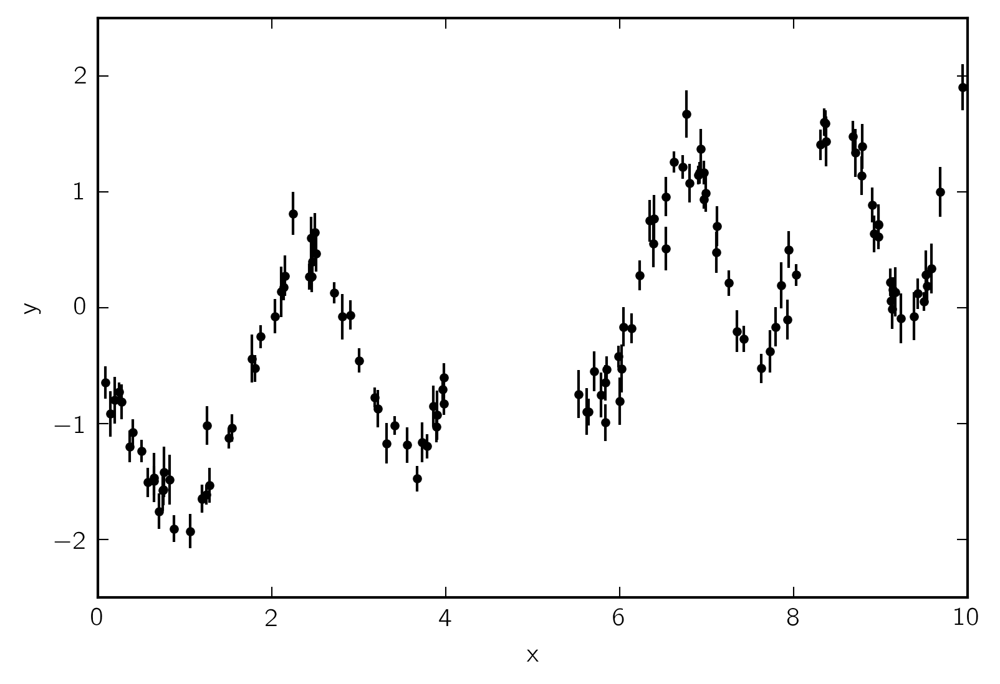
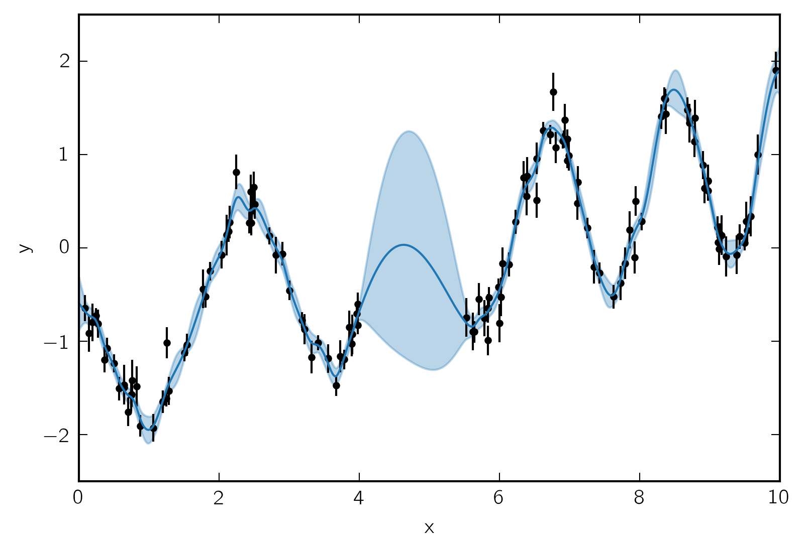
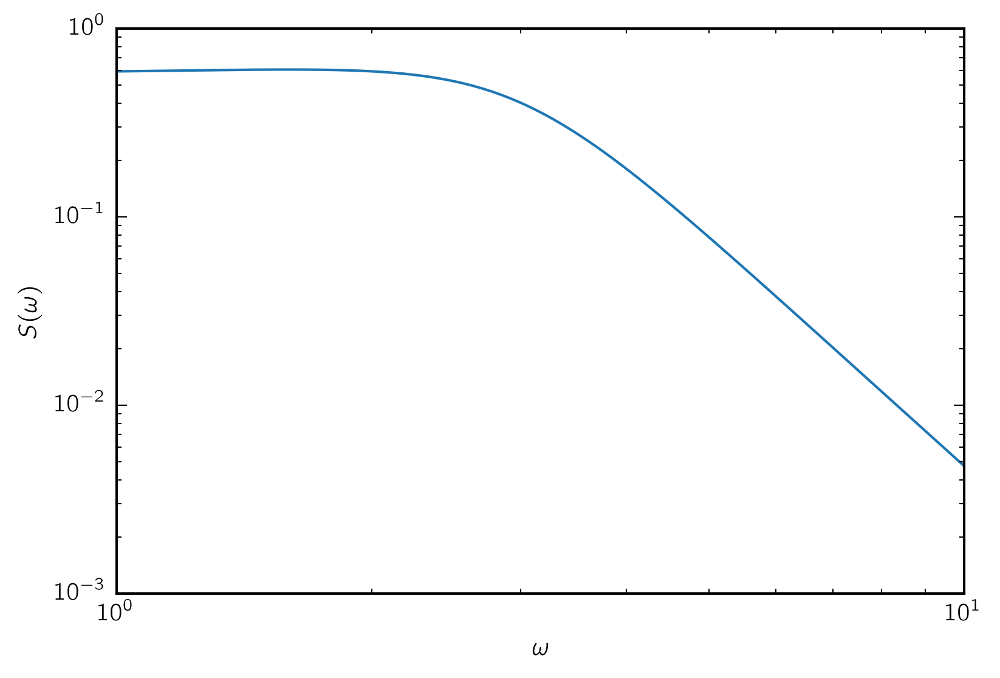
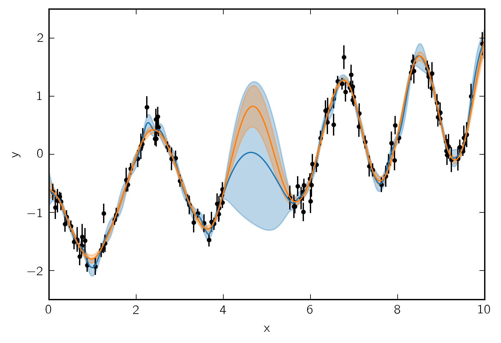
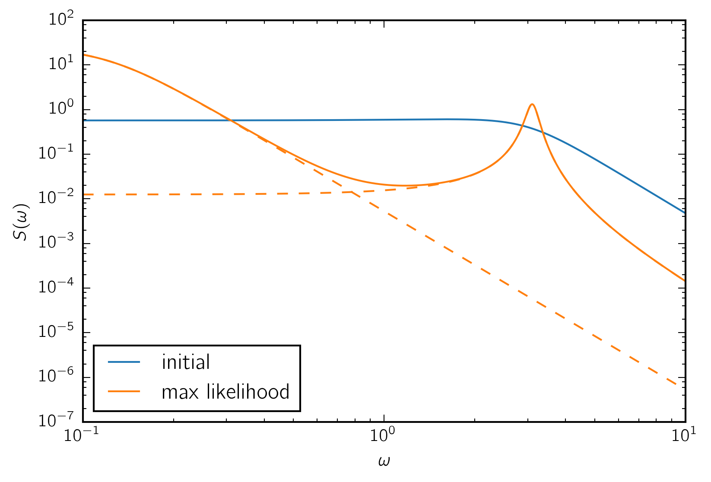

.. module:: celerite

.. note:: This tutorial was generated from an IPython notebook that can be
          downloaded `here <../../_static/notebooks/getting_started.ipynb>`_.

.. _getting_started:

Getting started
===============

First generate a simulated dataset:

.. code:: python

    import numpy as np
    import matplotlib.pyplot as plt
    np.random.seed(42)
    
    t = np.sort(np.append(
        np.random.uniform(0, 4.1, 57),
        np.random.uniform(5.5, 10, 68),
    ))  # The input coordinates must be sorted
    yerr = np.random.uniform(0.08, 0.22, len(t))
    y = 0.2 * (t-5) + np.sin(3*t + 0.1*(t-5)**2) + yerr * np.random.randn(len(t))
    
    plt.errorbar(t, y, yerr=yerr, fmt=".k", capsize=0)
    plt.xlabel("x")
    plt.ylabel("y")
    plt.xlim(0, 10)
    plt.ylim(-2.5, 2.5);

Now let's fit this using ``celerite``.

.. code:: python

    import celerite
    from celerite import terms
    
    # A periodic component
    Q = 1.0
    w0 = 3.0
    S0 = np.var(y) / (w0 * Q)
    kernel = terms.SHOTerm(np.log(S0), np.log(Q), np.log(w0),
                           bounds=[(-15, 15), (-15, 15), (-15, 15)])
    
    # A non-periodic component
    Q = 1.0 / np.sqrt(2.0)
    w0 = 3.0
    S0 = np.var(y) / (w0 * Q)
    kernel += terms.SHOTerm(np.log(S0), np.log(Q), np.log(w0),
                            bounds=[(-15, 15), (-15, 15), (-15, 15)])
    
    gp = celerite.GP(kernel, mean=np.mean(y), fit_mean=True)
    gp.compute(t, yerr)
    print("Initial log likelihood: {0}".format(gp.log_likelihood(y)))
    
    x = np.linspace(0, 10, 5000)
    initial_mu, initial_var = gp.predict(y, x, return_var=True)
    
    initial_color = "#1f77b4"
    plt.errorbar(t, y, yerr=yerr, fmt=".k", capsize=0)
    plt.plot(x, initial_mu, color=initial_color)
    plt.fill_between(x, initial_mu + np.sqrt(initial_var),
                     initial_mu - np.sqrt(initial_var),
                     color=initial_color, alpha=0.3)
    plt.xlabel("x")
    plt.ylabel("y")
    plt.xlim(0, 10)
    plt.ylim(-2.5, 2.5)
    
    plt.figure()
    omega = np.linspace(0.1, 10, 5000)
    initial_psd = gp.kernel.get_psd(omega)
    plt.plot(omega, initial_psd, color=initial_color)
    plt.yscale("log")
    plt.xscale("log")
    plt.xlim(1, 10)
    plt.xlabel("$\omega$")
    plt.ylabel("$S(\omega)$");

.. parsed-literal::

    Initial log likelihood: -7.697249284340302

We can look at the parameters:

.. code:: python

    gp.get_parameter_dict()

.. parsed-literal::

    OrderedDict([('mean:value', -0.13537573068686803),
                 ('kernel:term[0]:log_S0', -1.2167235687061821),
                 ('kernel:term[0]:log_Q', 0.0),
                 ('kernel:term[0]:log_omega0', 1.0986122886681098),
                 ('kernel:term[1]:log_S0', -0.87014997842620934),
                 ('kernel:term[1]:log_Q', -0.34657359027997275),
                 ('kernel:term[1]:log_omega0', 1.0986122886681098)])

Let's freeze the Q-factor for the non-periodic component so that we
don't fit for it:

.. code:: python

    gp.freeze_parameter("kernel:term[1]:log_Q")
    gp.get_parameter_dict()

.. parsed-literal::

    OrderedDict([('mean:value', -0.13537573068686803),
                 ('kernel:term[0]:log_S0', -1.2167235687061821),
                 ('kernel:term[0]:log_Q', 0.0),
                 ('kernel:term[0]:log_omega0', 1.0986122886681098),
                 ('kernel:term[1]:log_S0', -0.87014997842620934),
                 ('kernel:term[1]:log_omega0', 1.0986122886681098)])

Fit for the maximum likelihood parameters:

.. code:: python

    from scipy.optimize import minimize
    
    def neg_log_like(params, y, gp):
        gp.set_parameter_vector(params)
        return -gp.log_likelihood(y)
    
    initial_params = gp.get_parameter_vector()
    bounds = gp.get_parameter_bounds()
    
    r = minimize(neg_log_like, initial_params, method="L-BFGS-B", bounds=bounds, args=(y, gp))
    gp.set_parameter_vector(r.x)
    print(r)

.. parsed-literal::

          fun: -15.861807874981082
     hess_inv: <6x6 LbfgsInvHessProduct with dtype=float64>
          jac: array([ -1.70530257e-05,  -6.25277607e-05,   4.26325641e-05,
            -1.22213351e-04,   9.09494702e-05,   1.16529009e-04])
      message: b'CONVERGENCE: REL_REDUCTION_OF_F_<=_FACTR*EPSMCH'
         nfev: 329
          nit: 38
       status: 0
      success: True
            x: array([ -8.19558541e-04,  -4.15780060e+00,   2.32896004e+00,
             1.13427743e+00,   3.45053505e+00,  -2.11692490e+00])

Here are the maximum likelihood parameters:

.. code:: python

    gp.get_parameter_dict()

.. parsed-literal::

    OrderedDict([('mean:value', -0.0008195585409595189),
                 ('kernel:term[0]:log_S0', -4.1578005977975963),
                 ('kernel:term[0]:log_Q', 2.328960041935737),
                 ('kernel:term[0]:log_omega0', 1.1342774287947972),
                 ('kernel:term[1]:log_S0', 3.4505350503307022),
                 ('kernel:term[1]:log_omega0', -2.1169249022674594)])

And here are the predictions that the maximum likelihood model makes:

.. code:: python

    mu, var = gp.predict(y, x, return_var=True)
    
    ml_color = "#ff7f0e"
    plt.errorbar(t, y, yerr=yerr, fmt=".k", capsize=0)
    plt.plot(x, initial_mu, color=initial_color)
    plt.fill_between(x, initial_mu + np.sqrt(initial_var),
                     initial_mu - np.sqrt(initial_var),
                     color=initial_color, alpha=0.3)
    plt.plot(x, mu, color=ml_color)
    plt.fill_between(x, mu + np.sqrt(var), mu - np.sqrt(var), color=ml_color, alpha=0.3)
    plt.xlabel("x")
    plt.ylabel("y")
    plt.xlim(0, 10)
    plt.ylim(-2.5, 2.5)
    
    plt.figure()
    psd = gp.kernel.get_psd(omega)
    plt.plot(omega, initial_psd, color=initial_color, label="initial")
    plt.plot(omega, psd, color=ml_color, label="max likelihood")
    plt.legend(loc=3, fontsize=12)
    
    # Let's plot each component of the PSD:
    for k in gp.kernel.terms:
        plt.plot(omega, k.get_psd(omega), "--", color=ml_color)
    
    plt.yscale("log")
    plt.xscale("log")
    plt.xlim(omega[0], omega[-1])
    plt.xlabel("$\omega$")
    plt.ylabel("$S(\omega)$");

