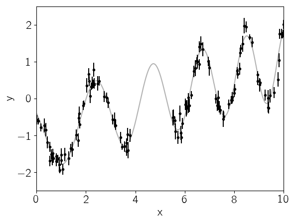

.. module:: celerite

.. note:: This tutorial was generated from an IPython notebook that can be
          downloaded `here <../../_static/notebooks/julia-first.ipynb>`_.

.. _julia-first:

Julia: First Steps
==================

This is just a copy of the Python demo.

.. code:: python

    import Optim
    import PyPlot
    import celerite

.. code:: python

    srand(42)
    
    # The input coordinates must be sorted
    t = sort(cat(1, 3.8 * rand(57), 5.5 + 4.5 * rand(68)))
    yerr = 0.08 + (0.22-0.08)*rand(length(t))
    y = 0.2*(t-5.0) + sin(3.0*t + 0.1*(t-5.0).^2) + yerr .* randn(length(t))
    
    true_t = linspace(0, 10, 5000)
    true_y = 0.2*(true_t-5) + sin(3*true_t + 0.1*(true_t-5).^2)
    
    PyPlot.plot(true_t, true_y, "k", lw=1.5, alpha=0.3)
    PyPlot.errorbar(t, y, yerr=yerr, fmt=".k", capsize=0)
    PyPlot.xlabel("x")
    PyPlot.ylabel("y")
    PyPlot.xlim(0, 10)
    PyPlot.ylim(-2.5, 2.5);

.. code:: python

    Q = 1.0 / sqrt(2.0)
    w0 = 3.0
    S0 = var(y) / (w0 * Q)
    kernel = celerite.SHOTerm(log(S0), log(Q), log(w0))
    
    # A periodic component
    Q = 1.0
    w0 = 3.0
    S0 = var(y) / (w0 * Q)
    kernel = kernel + celerite.SHOTerm(log(S0), log(Q), log(w0))

.. parsed-literal::

    celerite.TermSum((celerite.SHOTerm(-0.7432145976901582,-0.34657359027997275,1.0986122886681096),celerite.SHOTerm(-1.089788187970131,0.0,1.0986122886681096)))

.. code:: python

    gp = celerite.Celerite(kernel)
    celerite.compute(gp, t, yerr)
    celerite.log_likelihood(gp, y)

.. parsed-literal::

    -15.225587873319103

.. code:: python

    mu, variance = celerite.predict(gp, y, true_t, return_var=true)
    sigma = sqrt(variance)
    
    PyPlot.plot(true_t, true_y, "k", lw=1.5, alpha=0.3)
    PyPlot.errorbar(t, y, yerr=yerr, fmt=".k", capsize=0)
    PyPlot.plot(true_t, mu, "g")
    PyPlot.fill_between(true_t, mu+sigma, mu-sigma, color="g", alpha=0.3)
    PyPlot.xlabel("x")
    PyPlot.ylabel("y")
    PyPlot.xlim(0, 10)
    PyPlot.ylim(-2.5, 2.5);

.. image:: julia-first_files/julia-first_6_0.png

.. code:: python

    vector = celerite.get_parameter_vector(gp.kernel)
    mask = ones(Bool, length(vector))
    mask[2] = false  # Don't fit for the first Q
    function nll(params)
        vector[mask] = params
        celerite.set_parameter_vector(gp.kernel, vector)
        celerite.compute(gp, t, yerr)
        return -celerite.log_likelihood(gp, y)
    end

.. parsed-literal::

    nll (generic function with 1 method)

.. code:: python

    result = Optim.optimize(nll, vector[mask], Optim.LBFGS())
    result

.. parsed-literal::

    Results of Optimization Algorithm
     * Algorithm: L-BFGS
     * Starting Point: [-0.7432145976901582,1.0986122886681096, ...]
     * Minimizer: [3.0068763552021567,-2.005554052352084, ...]
     * Minimum: -3.042655e+00
     * Iterations: 21
     * Convergence: false
       * |x - x'| < 1.0e-32: false
       * |f(x) - f(x')| / |f(x)| < 1.0e-32: false
       * |g(x)| < 1.0e-08: false
       * f(x) > f(x'): true
       * Reached Maximum Number of Iterations: false
     * Objective Function Calls: 86
     * Gradient Calls: 86

.. code:: python

    vector[mask] = Optim.minimizer(result)
    celerite.set_parameter_vector(gp.kernel, vector)
    
    mu, variance = celerite.predict(gp, y, true_t, return_var=true)
    sigma = sqrt(variance)
    
    PyPlot.plot(true_t, true_y, "k", lw=1.5, alpha=0.3)
    PyPlot.errorbar(t, y, yerr=yerr, fmt=".k", capsize=0)
    PyPlot.plot(true_t, mu, "g")
    PyPlot.fill_between(true_t, mu+sigma, mu-sigma, color="g", alpha=0.3)
    PyPlot.xlabel("x")
    PyPlot.ylabel("y")
    PyPlot.xlim(0, 10)
    PyPlot.ylim(-2.5, 2.5);

.. image:: julia-first_files/julia-first_9_0.png

.. code:: python

    omega = exp(linspace(log(0.1), log(20), 5000))
    psd = celerite.get_psd(gp.kernel, omega)
    
    for term in gp.kernel.terms
        PyPlot.plot(omega, celerite.get_psd(term, omega), "--")
    end
    PyPlot.plot(omega, psd)
    
    PyPlot.yscale("log")
    PyPlot.xscale("log")
    PyPlot.xlim(omega[1], omega[end])
    PyPlot.xlabel("omega")
    PyPlot.ylabel("S(omega)");

.. image:: julia-first_files/julia-first_10_0.png

