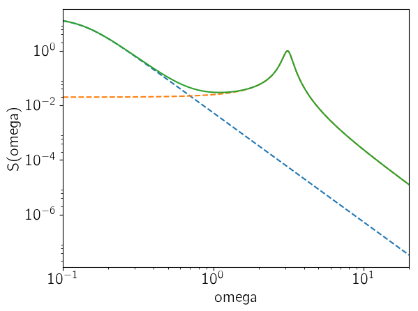
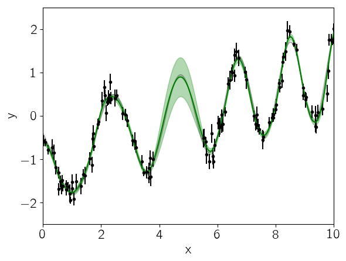
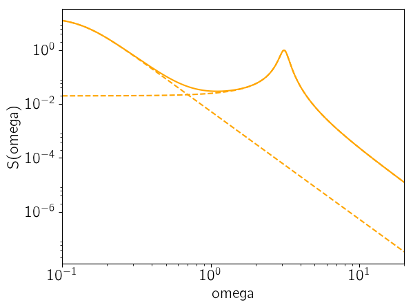

.. module:: celerite

.. note:: This tutorial was generated from an IPython notebook that can be
          downloaded `here <../../_static/notebooks/julia-first.ipynb>`_.

.. _julia-first:

Julia: First Steps
==================

.. note:: This tutorial is a version of the Python example `Python: First Steps <../first/>`_ ported to Julia. The text is copied, in large part, from there.

For this tutorial, we're going to fit a Gaussian Process (GP) model to a
simulated dataset with quasiperiodic oscillations. We're also going to
leave a gap in the simulated data and we'll use the GP model to predict
what we would have observed for those "missing" datapoints.

To start, here's some code to simulate the dataset:

.. code:: python

    import Optim
    import PyPlot
    import celerite
    
    srand(42)
    
    # The input coordinates must be sorted
    t = sort(cat(1, 3.8 * rand(57), 5.5 + 4.5 * rand(68)))
    yerr = 0.08 + (0.22-0.08)*rand(length(t))
    y = 0.2*(t-5.0) + sin(3.0*t + 0.1*(t-5.0).^2) + yerr .* randn(length(t))
    
    true_t = linspace(0, 10, 5000)
    true_y = 0.2*(true_t-5) + sin(3*true_t + 0.1*(true_t-5).^2)
    
    PyPlot.plot(true_t, true_y, "k", lw=1.5, alpha=0.3)
    PyPlot.errorbar(t, y, yerr=yerr, fmt=".k", capsize=0)
    PyPlot.xlabel("x")
    PyPlot.ylabel("y")
    PyPlot.xlim(0, 10)
    PyPlot.ylim(-2.5, 2.5);

.. image:: julia-first_files/julia-first_4_0.png

This plot shows the simulated data as black points with error bars and
the true function is shown as a gray line.

Now let's build the ``celerite`` model that we'll use to fit the data.
We can see that there's some roughly periodic signal in the data as well
as a longer term trend. To capture these two features, we will model
this as a mixture of two stochastically driven simple harmonic
oscillators with the power spectrum:

.. math::

   S(\omega) = \sqrt{\frac{2}{\pi}}\frac{S_1\,{\omega_1}^4}{(\omega^2 - {\omega_1}^2)^2 + 2\,{\omega_1}^2\,\omega^2}
   + \sqrt{\frac{2}{\pi}}\frac{S_2\,{\omega_2}^4}{(\omega^2 - {\omega_2}^2)^2 + {\omega_2}^2\,\omega^2/Q^2}

This model has 5 free parameters (:math:`S_1`, :math:`\omega_1`,
:math:`S_2`, :math:`\omega_2`, and :math:`Q`) and they must all be
positive. In ``celerite``, this is how you would build this model,
choosing more or less arbitrary initial values for the parameters.

.. code:: python

    Q = 1.0 / sqrt(2.0)
    w0 = 3.0
    S0 = var(y) / (w0 * Q)
    kernel = celerite.SHOTerm(log(S0), log(Q), log(w0))
    
    # A periodic component
    Q = 1.0
    w0 = 3.0
    S0 = var(y) / (w0 * Q)
    kernel = kernel + celerite.SHOTerm(log(S0), log(Q), log(w0))

.. parsed-literal::

    celerite.TermSum((celerite.SHOTerm(-0.7432145976901582,-0.34657359027997275,1.0986122886681096),celerite.SHOTerm(-1.089788187970131,0.0,1.0986122886681096)))

Then we wrap this kernel in a ``Celerite`` type that can be used for
computing the likelihood function.

.. code:: python

    gp = celerite.Celerite(kernel)
    celerite.compute!(gp, t, yerr)
    celerite.log_likelihood(gp, y)

.. parsed-literal::

    -15.225587873319103

We can look at the prediction from our initial guess at the model and
see how it compares to the true relation:

.. code:: python

    mu, variance = celerite.predict(gp, y, true_t, return_var=true)
    sigma = sqrt(variance)
    
    PyPlot.plot(true_t, true_y, "k", lw=1.5, alpha=0.3)
    PyPlot.errorbar(t, y, yerr=yerr, fmt=".k", capsize=0)
    PyPlot.plot(true_t, mu, "g")
    PyPlot.fill_between(true_t, mu+sigma, mu-sigma, color="g", alpha=0.3)
    PyPlot.xlabel("x")
    PyPlot.ylabel("y")
    PyPlot.xlim(0, 10)
    PyPlot.ylim(-2.5, 2.5);

Now we'll use the ``L-BFGS`` non-linear optimization routine from the
``Optim`` package to find the maximum likelihood parameters for this
model.

.. code:: python

    vector = celerite.get_parameter_vector(gp.kernel)
    mask = ones(Bool, length(vector))
    mask[2] = false  # Don't fit for the first Q
    function nll(params)
        vector[mask] = params
        celerite.set_parameter_vector!(gp.kernel, vector)
        celerite.compute!(gp, t, yerr)
        return -celerite.log_likelihood(gp, y)
    end;

.. code:: python

    result = Optim.optimize(nll, vector[mask], Optim.LBFGS())
    result

.. parsed-literal::

    Results of Optimization Algorithm
     * Algorithm: L-BFGS
     * Starting Point: [-0.7432145976901582,1.0986122886681096, ...]
     * Minimizer: [3.0068763552021567,-2.005554052352084, ...]
     * Minimum: -3.042655e+00
     * Iterations: 21
     * Convergence: false
       * |x - x'| < 1.0e-32: false
       * |f(x) - f(x')| / |f(x)| < 1.0e-32: false
       * |g(x)| < 1.0e-08: false
       * f(x) > f(x'): true
       * Reached Maximum Number of Iterations: false
     * Objective Function Calls: 86
     * Gradient Calls: 86

The maximum likelihood parameters are the following:

.. code:: python

    vector[mask] = Optim.minimizer(result)
    vector

.. parsed-literal::

    6-element Array{Float64,1}:
      3.00688 
     -0.346574
     -2.00555 
     -3.69141 
      1.94525 
      1.13941 

Finally, let's see what the model predicts for the underlying function.
A GP model can predict the (Gaussian) conditional (on the observed data)
distribution for new observations. Let's do that on a fine grid:

.. code:: python

    celerite.set_parameter_vector!(gp.kernel, vector)
    
    mu, variance = celerite.predict(gp, y, true_t, return_var=true)
    sigma = sqrt(variance)
    
    PyPlot.plot(true_t, true_y, "k", lw=1.5, alpha=0.3)
    PyPlot.errorbar(t, y, yerr=yerr, fmt=".k", capsize=0)
    PyPlot.plot(true_t, mu, "g")
    PyPlot.fill_between(true_t, mu+sigma, mu-sigma, color="g", alpha=0.3)
    PyPlot.xlabel("x")
    PyPlot.ylabel("y")
    PyPlot.xlim(0, 10)
    PyPlot.ylim(-2.5, 2.5);

In this figure, the 1-sigma prediction is shown as a green band and the
mean prediction is indicated by a solid green line. Comparing this to
the true underlying function (shown as a gray line), we see that the
prediction is consistent with the truth at all times and the the
uncertainty in the region of missing data increases as expected.

As the last figure, let's look at the maximum likelihood power spectrum
of the model. The following figure shows the model power spectrum as a
solid line and the dashed lines show the contributions from the two
components.

.. code:: python

    omega = exp(linspace(log(0.1), log(20), 5000))
    psd = celerite.get_psd(gp.kernel, omega)
    
    for term in gp.kernel.terms
        PyPlot.plot(omega, celerite.get_psd(term, omega), "--", color="orange")
    end
    PyPlot.plot(omega, psd, color="orange")
    
    PyPlot.yscale("log")
    PyPlot.xscale("log")
    PyPlot.xlim(omega[1], omega[end])
    PyPlot.xlabel("omega")
    PyPlot.ylabel("S(omega)");

