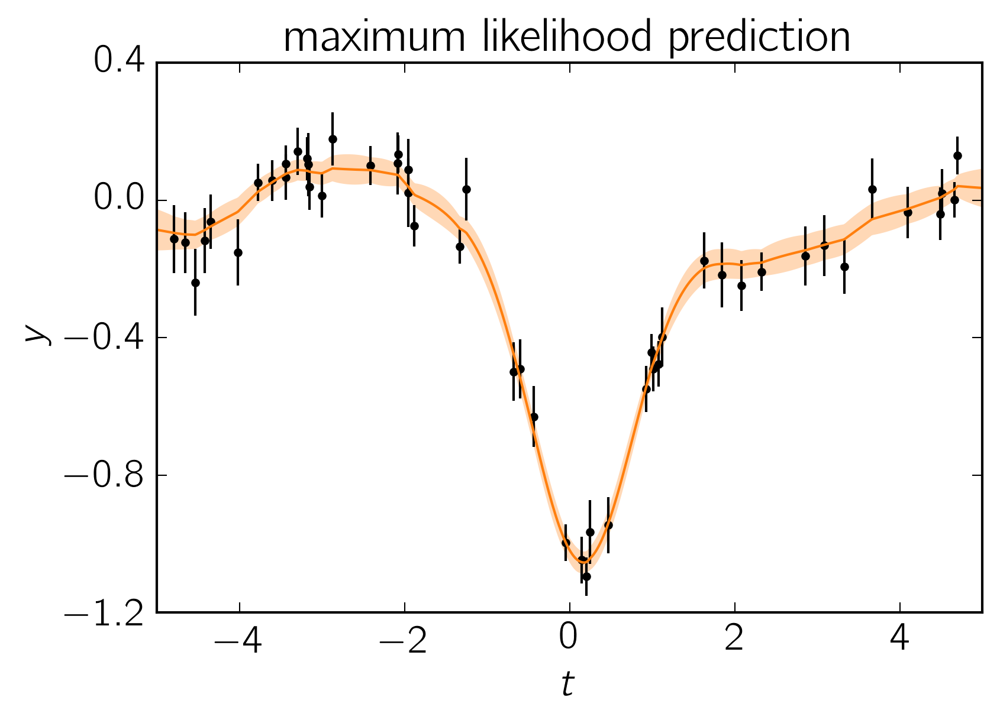
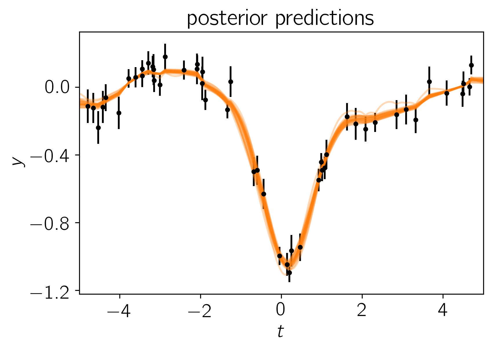
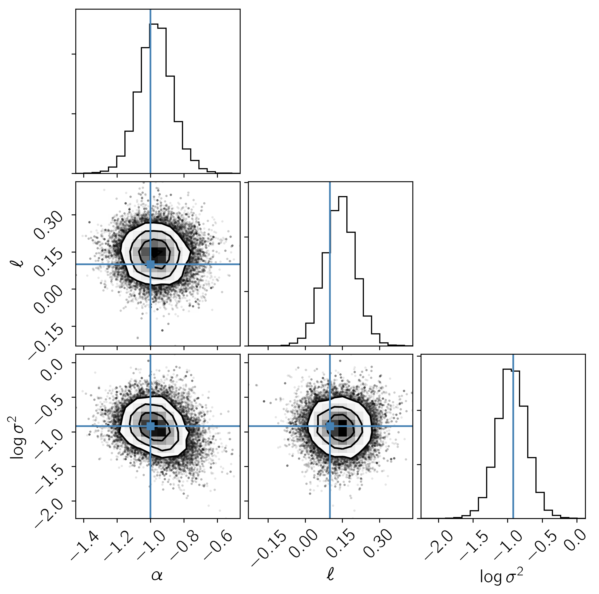

.. module:: celerite

.. note:: This tutorial was generated from an IPython notebook that can be
          downloaded `here <../../_static/notebooks/modeling.ipynb>`_.

.. _modeling:

Python: Modeling
================

This tutorial will demonstrate how you can use the modeling protocol in
celerite to fit for the mean parameters simultaneously with the kernel
parameters.

In this example, we’re going to simulate a common data analysis
situation where our dataset exhibits unknown correlations in the noise.
When taking data, it is often possible to estimate the independent
measurement uncertainty on a single point (due to, for example, Poisson
counting statistics) but there are often residual systematics that
correlate data points. The effect of this correlated noise can often be
hard to estimate but ignoring it can introduce substantial biases into
your inferences. In the following sections, we will consider a synthetic
dataset with correlated noise and a simple non-linear model. We will fit
these data by modeling the covariance structure in the data using a
Gaussian process.

A Simple Mean Model
-------------------

The model that we’ll fit in this demo is a single Gaussian feature with
three parameters: amplitude :math:`\alpha`, location :math:`\ell`, and
width :math:`\sigma^2`. I’ve chosen this model because is is the
simplest non-linear model that I could think of, and it is qualitatively
similar to a few problems in astronomy (fitting spectral features,
measuring transit times, etc.).

Simulated Dataset
-----------------

Let's start by simulating a dataset of 50 points with known correlated
noise. In fact, this example is somewhat artificial since the data were
drawn from a Gaussian process but in everything that follows, we’ll use
a different kernel function for our inferences in an attempt to make the
situation slightly more realistic. A known white variance was also added
to each data point.

Using the parameters

.. math:: \alpha = −1 \quad, \quad\quad \ell = 0.1 \quad, \quad\quad \sigma^2 = 0.4 \quad.

the resulting dataset is:

.. code:: python

    import numpy as np
    import matplotlib.pyplot as plt
    
    from celerite.modeling import Model
    
    # Define the model
    class MeanModel(Model):
        parameter_names = ("alpha", "ell", "log_sigma2")
        
        def get_value(self, t):
            return self.alpha * np.exp(-0.5*(t-self.ell)**2 * np.exp(-self.log_sigma2))
        
        # This method is optional but it can be used to compute the gradient of the
        # cost function below.
        def compute_gradient(self, t):
            e = 0.5*(t-self.ell)**2 * np.exp(-self.log_sigma2)
            dalpha = np.exp(-e)
            dell = self.alpha * dalpha * (t-self.ell) * np.exp(-self.log_sigma2)
            dlog_s2 = self.alpha * dalpha * e
            return np.array([dalpha, dell, dlog_s2])
    
    mean_model = MeanModel(alpha=-1.0, ell=0.1, log_sigma2=np.log(0.4))
    true_params = mean_model.get_parameter_vector()
    
    # Simuate the data
    np.random.seed(42)
    x = np.sort(np.random.uniform(-5, 5, 50))
    yerr = np.random.uniform(0.05, 0.1, len(x))
    K = 0.1*np.exp(-0.5*(x[:, None] - x[None, :])**2/10.5)
    K[np.diag_indices(len(x))] += yerr**2
    y = np.random.multivariate_normal(mean_model.get_value(x), K)
    
    # Plot the data
    plt.errorbar(x, y, yerr=yerr, fmt=".k", capsize=0)
    plt.ylabel(r"$y$")
    plt.xlabel(r"$t$")
    plt.xlim(-5, 5)
    plt.gca().yaxis.set_major_locator(plt.MaxNLocator(5))
    plt.title("simulated data");

.. image:: modeling_files/modeling_2_0.png

Modeling the Noise
------------------

**Note:** A full discussion of the theory of Gaussian processes is
beyond the scope of this demo—you should probably check out `Rasmussen &
Williams (2006) <http://www.gaussianprocess.org/gpml/>`__—but I'll try
to give a quick qualitative motivation for our model.

In this section, instead of assuming that the noise is white, we'll
include covariances between data points. Under the assumption of
Gaussianity, the likelihood function is

.. math::

       \ln p(\{y_n\}\,|\,\{t_n\},\,\{\sigma_n^2\},\,\theta) =
           -\frac{1}{2}\,\boldsymbol{r}^\mathrm{T}\,K^{-1}\,\boldsymbol{r}
           -\frac{1}{2}\,\ln\det K - \frac{N}{2}\,\ln 2\pi

where

.. math::

       \boldsymbol{r} = \left ( \begin{array}{c}
           y_1 - f_\theta(t_1) \\
           y_2 - f_\theta(t_2) \\
           \vdots \\
           y_N - f_\theta(t_N) \\
       \end{array}\right)

is the residual vector and :math:`K` is the :math:`N \times N` data
covariance matrix (where :math:``N`` is the number of data points) with
elements given by

.. math::

       K_{nm} = \sigma_n^2\,\delta_{nm} + k(t_n,\,t_m)

where :math:`\delta_{ij}` is the `Kronecker
delta <http://en.wikipedia.org/wiki/Kronecker_delta>`__ and
:math:`k(\cdot,\,\cdot)` is a covariance function that we get to choose.
We'll use a simple celerite ``RealTerm``

.. math::

       k(\tau_{nm}) = a \, \exp \left (-c\,\tau_{nm} \right )

where :math:`\tau_{nm} = |t_n - t_m|`, and :math:`a` and :math:`c` are
the parameters of the model.

The Fit
-------

Now we could go ahead and implement the likelihood function that we came
up with in the previous section but celerite does that for us. To
implement the model from the previous section, we can write the
following likelihood function in Python and find it's maximum using
scipy:

.. code:: python

    from scipy.optimize import minimize
    
    import celerite
    from celerite import terms
    
    # Set up the GP model
    kernel = terms.RealTerm(log_a=np.log(np.var(y)), log_c=-np.log(10.0))
    gp = celerite.GP(kernel, mean=mean_model, fit_mean=True)
    gp.compute(x, yerr)
    print("Initial log-likelihood: {0}".format(gp.log_likelihood(y)))
    
    # Define a cost function
    def neg_log_like(params, y, gp):
        gp.set_parameter_vector(params)
        return -gp.log_likelihood(y)
    
    def grad_neg_log_like(params, y, gp):
        gp.set_parameter_vector(params)
        return -gp.grad_log_likelihood(y)[1]
    
    # Fit for the maximum likelihood parameters
    initial_params = gp.get_parameter_vector()
    bounds = gp.get_parameter_bounds()
    soln = minimize(neg_log_like, initial_params, jac=grad_neg_log_like,
                    method="L-BFGS-B", bounds=bounds, args=(y, gp))
    gp.set_parameter_vector(soln.x)
    print("Final log-likelihood: {0}".format(-soln.fun))
    
    # Make the maximum likelihood prediction
    t = np.linspace(-5, 5, 500)
    mu, var = gp.predict(y, t, return_var=True)
    std = np.sqrt(var)
    
    # Plot the data
    color = "#ff7f0e"
    plt.errorbar(x, y, yerr=yerr, fmt=".k", capsize=0)
    plt.plot(t, mu, color=color)
    plt.fill_between(t, mu+std, mu-std, color=color, alpha=0.3, edgecolor="none")
    plt.ylabel(r"$y$")
    plt.xlabel(r"$t$")
    plt.xlim(-5, 5)
    plt.gca().yaxis.set_major_locator(plt.MaxNLocator(5))
    plt.title("maximum likelihood prediction");

.. parsed-literal::

    Initial log-likelihood: 49.899172867379185
    Final log-likelihood: 54.018158109128926

To fit this model using MCMC (using `emcee <http://dfm.io/emcee>`__), we
need to first choose priors—in this case we’ll just use a simple uniform
prior on each parameter—and then combine these with our likelihood
function to compute the log probability (up to a normalization
constant). In code, this will be:

.. code:: python

    def log_probability(params):
        gp.set_parameter_vector(params)
        lp = gp.log_prior()
        if not np.isfinite(lp):
            return -np.inf
        return gp.log_likelihood(y) + lp

Now that we have our model implemented, we’ll initialize the walkers and
run both a burn-in and production chain:

.. code:: python

    import emcee
    
    initial = np.array(soln.x)
    ndim, nwalkers = len(initial), 32
    sampler = emcee.EnsembleSampler(nwalkers, ndim, log_probability)
    
    print("Running burn-in...")
    p0 = initial + 1e-8 * np.random.randn(nwalkers, ndim)
    p0, lp, _ = sampler.run_mcmc(p0, 500)
    
    print("Running production...")
    sampler.reset()
    sampler.run_mcmc(p0, 2000);

.. parsed-literal::

    Running burn-in...
    Running production...

After running the chain, we can plot the predicted results. It is often
useful to plot the results on top of the data as well. To do this, we
can over plot 24 posterior samples on top of the data:

.. code:: python

    # Plot the data.
    plt.errorbar(x, y, yerr=yerr, fmt=".k", capsize=0)
    
    # Plot 24 posterior samples.
    samples = sampler.flatchain
    for s in samples[np.random.randint(len(samples), size=24)]:
        gp.set_parameter_vector(s)
        mu = gp.predict(y, t, return_cov=False)
        plt.plot(t, mu, color=color, alpha=0.3)
        
    plt.ylabel(r"$y$")
    plt.xlabel(r"$t$")
    plt.xlim(-5, 5)
    plt.gca().yaxis.set_major_locator(plt.MaxNLocator(5))
    plt.title("posterior predictions");

In this figure, the data are shown as black points with error bars and
the posterior samples are shown as translucent orange lines. These
results seem pretty satisfying but, since we know the true model
parameters that were used to simulate the data, we can assess the fit by
comparing the inferences to the true values. To do this, we’ll plot all
the projections of our posterior samples using
`corner.py <https://github.com/dfm/corner.py>`__ and over plot the true
values:

.. code:: python

    import corner
    names = gp.get_parameter_names()
    cols = mean_model.get_parameter_names()
    inds = np.array([names.index("mean:"+k) for k in cols])
    corner.corner(sampler.flatchain[:, inds], truths=true_params,
                  labels=[r"$\alpha$", r"$\ell$", r"$\log\sigma^2$"]);

It is clear from this figure that the constraints obtained for the mean
parameters when modeling the noise are reasonable even though our noise
model was "wrong".

