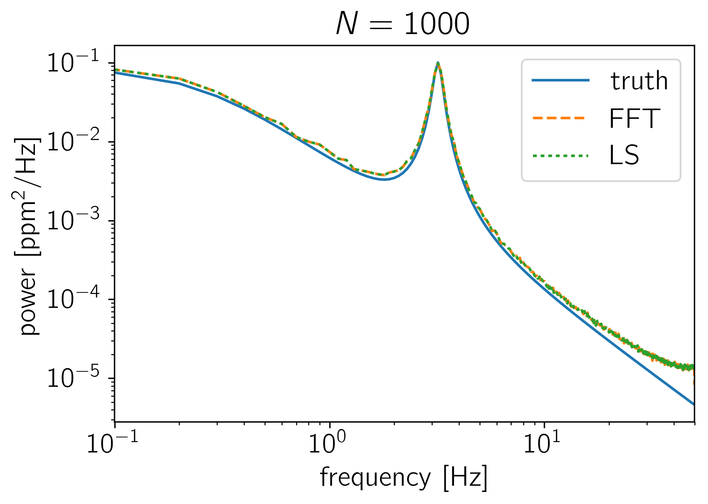
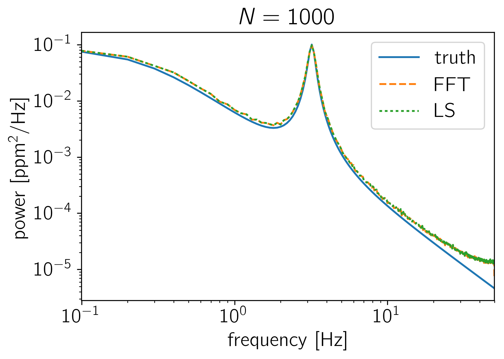

.. module:: celerite

.. note:: This tutorial was generated from an IPython notebook that can be
          downloaded `here <../../_static/notebooks/normalization.ipynb>`_.

.. _normalization:

PSD Normalization
=================

The crux of many time series analysis problems is the question of where
all the factors of :math:`N` and :math:`2\,\pi` enter. In this tutorial,
we'll look at how the PSD returned by celerite should be compared to an
estimate made using NumPy's FFT library or to an estimate made using a
Lomb-Scargle periodogram. To make this comparison, we'll sample many
realizations from a celerite GP and compute the empirical power spectrum
using the standard methods and compare this (numerically) to the true
power spectrum as defined by celerite.

To start, here's a function that simulates :math:`K` random datasets
with :math:`N` data points from a celerite model and computes the mean
FFT and Lomb-Scargle estimators of the power spectrum.

.. code:: python

    import numpy as np
    import matplotlib.pyplot as plt
    from astropy.stats import LombScargle
    
    import celerite
    from celerite import terms
    
    def simulate_and_compute_psds(N, K=1500):
        # Set up a simple celerite model
        kernel = terms.RealTerm(0.1, 0.5) + terms.ComplexTerm(0.5, 0.05, 3.0)
        gp = celerite.GP(kernel)
        
        # Simulate K datasets with N points
        t = np.linspace(0, 10, N)
        gp.compute(t)
        np.random.seed(42)
        y = gp.sample(size=K)
        
        # Compute the FFT based power spectrum estimates
        f = np.fft.rfftfreq(len(t), t[1] - t[0])
        fft = np.array(list(map(np.fft.rfft, y)))
        fft *= np.conj(fft)
        
        # >>> To get the FFT based PSD in the correct units, normalize by N^2 <<<
        power_fft = fft.real / N**2
    
        # Compute the LS based power spectrum estimates
        power_ls = []
        for y0 in y:
            model = LombScargle(t, y0)
            power_ls.append(model.power(f[1:-1], method="fast", normalization="psd"))
        power_ls = np.array(power_ls)
        
        # >>> To get the LS based PSD in the correct units, normalize by N <<<
        power_ls /= N
        
        # Compute the true power spectrum
        # NOTE: the 2*pi enters because celerite computes the PSD in _angular_ frequency
        power_true = kernel.get_psd(2*np.pi*f)
        
        # >>> To get the true PSD in units of physical frequency, normalize by 2*pi <<<
        power_true /= 2*np.pi
        
        # Let's plot the estimates of the PSD
        plt.figure()
        plt.plot(f, power_true, label="truth")
        plt.plot(f, np.median(power_fft, axis=0), "--", label="FFT")
        plt.plot(f[1:-1], np.median(power_ls, axis=0), ":", label="LS")
        plt.yscale("log")
        plt.xscale("log")
        plt.xlim(f.min(), f.max())
        plt.ylabel("power [$\mathrm{ppm}^2/\mathrm{Hz}$]")
        plt.xlabel("frequency [Hz]")
        plt.title("$N = {0}$".format(N))
        plt.legend()
        
    simulate_and_compute_psds(500)
    simulate_and_compute_psds(1000)

.. parsed-literal::

    (1500, 500)
    (1500, 1000)

